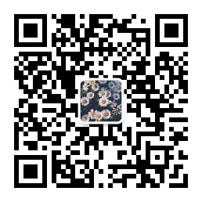

# AI Video Storyboard Platform


<p align="center">
  <strong>从灵感到成片，AI 全程辅助 —— 让每个人都能做导演</strong>
</p>


<p align="center">
  
</p>

<p align="center">
  <strong>关注公众号，获取更多 AI 资讯与动态</strong>
</p>

<p align="center">
  📧 联系我：<a href="mailto:gongfan1213@163.com">gongfan1213@163.com</a>
</p>

---

## 这些痛点，你中了几条？

- **脑子里有画面，写不出来** —— 想拍一个短视频，分镜脚本却要磨一整天，从创意到落地遥遥无期。
- **AI 生成视频像"拼接怪"** —— 用各类工具生成片段，风格和动作接不上，剪在一起违和感爆棚。
- **客户/老板突然改需求** —— 场景推倒重来，分镜、脚本、参考图全部返工，通宵加班成常态。
- **不懂摄影术语，没法精细控制** —— 想让镜头"推近+慢动作+电影感"，却不知道如何在提示词里表达。
- **多段视频无法保持角色/场景一致** —— 主角这一秒长这样，下一秒换了一张脸。

**如果你遇到过以上任意一条，这个平台就是为你打造的。**

---

## 一句话说明白

**AI Video Storyboard Platform** 是一个从 **创意对话 → AI 分镜规划 → 精细调控 → 批量视频生成** 的一站式工作台。你只需要用自然语言描述想法，AI 自动帮你拆场景、写分镜、配摄影技术，并生成**风格连贯**的多段视频。

---

## 为谁而做？

| 人群 | 典型场景 |
|------|---------|
| **短视频创作者 / MCN 编导** | 日更压力大，需要快速出分镜、批量生成素材 |
| **独立动画 / 广告制作人** | 没有完整团队，一个人也要完成从策划到成片 |
| **AI 视频爱好者** | 想用 AI 做连贯故事短片，但受困于片段不统一 |
| **品牌营销 / 创意代理** | 客户提案需要可视化分镜和 Demo，时间紧、变化多 |
| **影视专业学生** | 学习分镜语言，通过 AI 快速验证创意想法 |

---

## 传统方式 vs AI 工作台

| 环节 | 传统方式 | 使用本平台 |
|------|---------|-----------|
| 创意构思 | 自己脑暴，容易卡壳 | **和 AI 对话**，一句话激发完整创意 |
| 分镜脚本 | 手写或画分镜，耗时数小时 | **AI 三阶段生成**，5 分钟出完整分镜 |
| 镜头描述 | 凭感觉写，效果不稳定 | **八要素结构化描述**，每个镜头专业可控 |
| 视频生成 | 逐个片段抽卡，风格杂乱 | **链式首尾帧衔接**，多段视频视觉统一 |
| 需求变更 | 推倒重来，加班返工 | **画布节点随时调整**，改一处自动同步 |
| 摄影控制 | 需要专业知识 | **33+ 预设技术一键套用**，小白也能出大片感 |

**结果：原本 1 天的分镜工作，压缩到 30 分钟。**

---


---

## 功能特性

### 1. AI 分镜生成（核心功能）

通过与 AI 对话，自然语言创作视频分镜：

```
用户: "我想做一个关于乌龟参加运动会的动画短片，风格是日系动漫"
```

AI 自动完成三阶段生成：

#### Stage 1: 概念阶段 (Concept)

```
┌─────────────────────────────────────────────────────────────┐
│  创意分析                                                    │
│  - 核心创意: 乌龟的励志故事                                   │
│  - 风格预设: Anime (日系动漫)                                │
│  - 目标受众: 全年龄向                                         │
│  - 目标时长: 30 秒                                           │
├─────────────────────────────────────────────────────────────┤
│  场景拆分                                                    │
│  ┌────────┬────────┬────────┬────────┐                     │
│  │ 场景 1 │ 场景 2 │ 场景 3 │ 场景 4 │  (共 4 个场景)       │
│  │  铺垫  │  冲突  │  高潮  │  结尾  │                     │
│  └────────┴────────┴────────┴────────┘                     │
└─────────────────────────────────────────────────────────────┘
```

#### Stage 2: 规划阶段 (Planning)

```
┌─────────────────────────────────────────────────────────────┐
│  分镜规划                                                    │
│                                                             │
│  总镜头数: 6  │  总时长: 28 秒                               │
│                                                             │
│  ┌────┬────┬────┬────┬────┬────┐                           │
│  │镜头1│镜头2│镜头3│镜头4│镜头5│镜头6│                      │
│  │ 5s │ 4s │ 6s │ 5s │ 4s │ 4s │                           │
│  │推近│特写│中景│远景│升格│慢动作│                           │
│  └────┴────┴────┴────┴────┴────┘                           │
└─────────────────────────────────────────────────────────────┘
```

#### Stage 3: 分镜阶段 (Storyboard)

每个镜头包含完整的 **八要素** 描述：

| 要素 | 示例输出 |
|------|---------|
| **主体 (subject)** | Q版萌系乌龟举着小奖杯 |
| **构图 (composition)** | 冲线的乌龟位于画面居中位置，平角度居中构图，深景深 |
| **光线 (lighting)** | 顶光漫射柔光，暖调明亮氛围 |
| **背景 (background)** | 终点线挂着彩色小旗子，森林小动物欢呼 |
| **动作/运动 (actionMovement)** | 乌龟缓慢冲过终点线，镜头固定不动 |
| **文字叠加 (textOverlay)** | 无 |
| **转场细节 (transitionDetail)** | fade淡出，乌龟举奖杯庆祝时慢慢淡出 |
| **音频 (audio)** | 背景音乐到达欢快高潮段，搭配欢呼声 |

### 2. 可视化画布编辑器

基于 React Flow 的节点式编辑器，实时预览和编辑分镜：

```
┌──────────────────────────────────────────────────────────────────┐
│                        Canvas Panel                               │
│  ┌────────────────┐    ┌────────────────┐    ┌────────────────┐  │
│  │   ConfigNode   │───▶│   ConfigNode   │───▶│   ConfigNode   │  │
│  │   (镜头 1)     │    │   (镜头 2)     │    │   (镜头 3)     │  │
│  │                │    │                │    │                │  │
│  │  Prompt: ...   │    │  Prompt: ...   │    │  Prompt: ...   │  │
│  │  Techniques:   │    │  Techniques:   │    │  Techniques:   │  │
│  │  - 低角度      │    │  - 推近        │    │  - 斯坦尼康    │  │
│  │  - 电影感      │    │  - 慢动作      │    │  - 环绕        │  │
│  └────────────────┘    └────────────────┘    └────────────────┘  │
│          │                   │                   │              │
│          ▼                   ▼                   ▼              │
│  ┌────────────────┐    ┌────────────────┐    ┌────────────────┐  │
│  │   VideoNode    │    │   VideoNode    │    │   VideoNode    │  │
│  │   [▶ 视频 1]   │    │   [▶ 视频 2]   │    │   [▶ 视频 3]   │  │
│  └────────────────┘    └────────────────┘    └────────────────┘  │
│                                                                  │
│  ═══════════════════════════════════════════════════════════════│
│  [+ 添加节点]  [⤴️ 链式生成全部]  [📥 导出 JSON]  [💾 保存]       │
└──────────────────────────────────────────────────────────────────┘
```

### 3. 摄影技术库

33+ 预设摄影技术，一键应用到镜头：

#### Angle（角度）- 6 种

```
低角度        水平视角      高角度        荷兰角        鸟瞰          俯视
   ↑            →            ↓            ↗            ⊕            ∠
```

#### View（景别）- 6 种

```
极特写        特写          中景          全景          远景          过肩
   ■■          ■■■          ■■■■■        ■■■■■■■      ■■■■■■■■■    ■■■■■
```

#### Movement（运动）- 12 种

| 技术 | 说明 |
|------|------|
| 推近 (Push In) | 镜头向主体推进 |
| 拉远 (Pull Out) | 镜头从主体拉远 |
| 左摇 (Pan Left) | 镜头向左横扫 |
| 右摇 (Pan Right) | 镜头向右横扫 |
| 上摇 (Tilt Up) | 镜头向上摇动 |
| 下摇 (Tilt Down) | 镜头向下摇动 |
| 跟踪 (Tracking) | 跟随主体移动 |
| 环绕 (Orbiting) | 绕主体环绕 |
| Zoom In | 镜头放大 |
| Zoom Out | 镜头缩小 |
| 升降 (Crane) | 镜头升降 |
| 斯坦尼康 (Steadicam) | 手持稳定器 |

#### Style（风格）- 9 种

```
电影感        纪录片        MV            慢动作        延时
🎬            📽            🎵            ⏱            ⏰
蒙太奇        手持          航拍          黑色电影      蒸汽波
🎞            📷            🚁            🎥            🌃
```

### 4. 三种视频生成模式

#### T2V (Text-to-Video) 文生视频

```
输入: "一只乌龟在森林里奔跑"
   ↓
输出: [生成的视频]
```

#### I2V (Image-to-Video) 图生视频

```
首帧图片 + 文本描述
   ↓
输出: [以首帧为起点生成的视频]
```

#### R2V (Reference-to-Video) 参考视频（需要 Seedance 1.0 Pro）

```
首帧图片 + 尾帧图片 + 文本描述
   ↓
输出: [从首帧过渡到尾帧的视频]
```

### 5. 链式视频生成

确保多个视频片段的视觉连贯性：

```
┌────────────────────────────────────────────────────────────────────┐
│                       Chain Generation                              │
│                                                                     │
│  Shot 1:  [首帧]──────┐                                             │
│         AI 生成       ▼                                              │
│                    [视频1] → [尾帧1] ─┐                              │
│                                      ▼                              │
│  Shot 2:  [首帧2] = [尾帧1] ───────┐ │                              │
│              继承自上一镜头         ▼ │                              │
│                    [视频2] → [尾帧2] ─┤ │                             │
│                                      ▼ │                             │
│  Shot 3:  [首帧3] = [尾帧2] ───────┐ │ │                            │
│              继承自上一镜头         ▼ │ │                            │
│                    [视频3] → [尾帧3] ─┴─┘                             │
│                                                                     │
│  结果: 三段视频视觉连贯，动作衔接自然                                  │
└────────────────────────────────────────────────────────────────────┘
```

### 6. 九宫格多角度生成

```
┌─────────┬─────────┬─────────┐
│  正面    │  侧面    │  背面    │
│  特写    │  特写    │  特写    │
├─────────┼─────────┼─────────┤
│  正面    │  侧面    │  背面    │
│  中景    │  中景    │  中景    │
├─────────┼─────────┼─────────┤
│  正面    │  侧面    │  背面    │
│  全景    │  全景    │  全景    │
└─────────┴─────────┴─────────┘
     可选择其中一张作为参考图
```

---

## 技术架构

### 技术栈

| 层级 | 技术 | 说明 |
|------|------|------|
| **前端框架** | Next.js 16.2.1 + React 19.2.4 | App Router 架构 |
| **语言** | TypeScript | 类型安全 |
| **可视化编辑器** | React Flow (@xyflow/react) | 节点图编辑 |
| **状态管理** | Zustand | 轻量级状态管理 |
| **样式** | Tailwind CSS v4 + shadcn/ui | 现代化 UI |
| **动画** | Framer Motion | 交互动画 |
| **AI SDK** | Vercel AI SDK + @ai-sdk/react | AI 模型集成 |
| **AI 模型** | 火山引擎 ARK API | 豆包/Seedance/Seedream |
| **数据库** | Supabase | PostgreSQL + 实时订阅 |
| **存储** | Supabase Storage | 项目媒体存储 |

### 系统架构图

```
┌─────────────────────────────────────────────────────────────────────────┐
│                           Client (Browser)                              │
│  ┌─────────────────────────────────────────────────────────────────┐   │
│  │                     Next.js Application                          │   │
│  │  ┌──────────────┐  ┌──────────────┐  ┌──────────────────────┐  │   │
│  │  │  CanvasPanel │  │  LeftPanel    │  │    RightPanel        │  │   │
│  │  │  - ConfigNode│  │  - Technique │  │    - ChatMessages    │  │   │
│  │  │  - VideoNode │  │    Library   │  │    - StoryboardTabs  │  │   │
│  │  └──────────────┘  └──────────────┘  └──────────────────────┘  │   │
│  │         │                                        │               │   │
│  │         ▼                                        ▼               │   │
│  │  ┌──────────────────────────────────────────────────────────┐    │   │
│  │  │                    Zustand Store                          │    │   │
│  │  │  ┌─────────────┐ ┌─────────────┐ ┌─────────────────────┐│    │   │
│  │  │  │ canvas-store│ │ technique-  │ │   app-shell-store  ││    │   │
│  │  │  │  (nodes/    │ │   store     │ │                     ││    │   │
│  │  │  │   edges)    │ │             │ │                     ││    │   │
│  │  │  └─────────────┘ └─────────────┘ └─────────────────────┘│    │   │
│  │  └──────────────────────────────────────────────────────────┘    │   │
│  └─────────────────────────────────────────────────────────────────┘   │
└─────────────────────────────────────────────────────────────────────────┘
                                    │
                                    ▼
┌─────────────────────────────────────────────────────────────────────────┐
│                           API Routes (Next.js)                           │
│  ┌─────────────┐ ┌─────────────┐ ┌─────────────┐ ┌─────────────────┐   │
│  │ /api/chat   │ │ /api/       │ │ /api/       │ │ /api/config     │   │
│  │             │ │ generate    │ │ generate-   │ │                 │   │
│  │ Doubao AI   │ │ image       │ │ image/[id]  │ │ API Key Check   │   │
│  └─────────────┘ └─────────────┘ └─────────────┘ └─────────────────┘   │
│  ┌─────────────┐ ┌─────────────┐ ┌─────────────┐ ┌─────────────────┐   │
│  │ /api/       │ │ /api/       │ │ /api/       │ │ /api/project-   │   │
│  │ generate    │ │ generate-   │ │ generate-   │ │ media/          │   │
│  │             │ │ frame       │ │ multi-frame│ │                 │   │
│  └─────────────┘ └─────────────┘ └─────────────┘ └─────────────────┘   │
└─────────────────────────────────────────────────────────────────────────┘
                                    │
                    ┌───────────────┼───────────────┐
                    ▼               ▼               ▼
┌─────────────────────────┐ ┌─────────────────┐ ┌─────────────────────┐
│   Volcano Engine ARK    │ │   Supabase      │ │   Supabase Storage   │
│                         │ │                 │ │                     │
│  ┌─────────────────┐   │ │  PostgreSQL     │ │  project-media       │
│  │  Doubao (豆包)   │   │ │  - profiles     │ │  bucket              │
│  │  - Chat Model   │   │ │  - projects     │ │                      │
│  │  - Storyboard   │   │ │  - assets       │ │                      │
│  └─────────────────┘   │ │  - generation_  │ │                      │
│  ┌─────────────────┐   │ │    tasks       │ │                      │
│  │ Seedance (视频)  │   │ │                 │ │                      │
│  │  - T2V/I2V/R2V  │   │ └─────────────────┘ │                      │
│  └─────────────────┘   │                       └─────────────────────┘
│  ┌─────────────────┐   │
│  │ Seedream (图像) │   │
│  │  - 角色/九宫格  │   │
│  └─────────────────┘   │
└─────────────────────────┘
```

### 数据模型

```
┌─────────────────────────────────────────────────────────────────────────┐
│                              Supabase Schema                             │
│  ┌────────────────┐  ┌────────────────┐  ┌────────────────────────┐    │
│  │   profiles     │  │   projects     │  │   generation_tasks     │    │
│  ├────────────────┤  ├────────────────┤  ├────────────────────────┤    │
│  │ id (uuid)      │  │ id (uuid)      │  │ id (uuid)              │    │
│  │ user_id (fk)   │  │ user_id (fk)   │  │ project_id (fk)       │    │
│  │ nickname       │  │ name           │  │ task_type              │    │
│  │ avatar_url     │  │ state (json)   │  │ task_id                │    │
│  │ created_at     │  │ created_at     │  │ status                 │    │
│  └────────────────┘  │ updated_at     │  │ created_at            │    │
│                      └────────────────┘  └────────────────────────┘    │
│  ┌────────────────┐                                                       │
│  │    assets      │                                                       │
│  ├────────────────┤                                                       │
│  │ id (uuid)      │                                                       │
│  │ project_id(fk) │                                                       │
│  │ file_url       │                                                       │
│  │ file_type      │                                                       │
│  │ created_at     │                                                       │
│  └────────────────┘                                                       │
└─────────────────────────────────────────────────────────────────────────┘
```

---

## 快速开始

### 环境要求

- Node.js 18+
- npm / yarn / pnpm
- Supabase 账号
- 火山引擎 ARK API Key

### 安装步骤

```bash
# 1. 克隆项目
git clone https://github.com/your-username/ai-video.git
cd ai-video

# 2. 安装依赖
npm install

# 3. 配置环境变量
cp .env.example .env.local
```

### 环境变量配置

```env
# Supabase 配置
NEXT_PUBLIC_SUPABASE_URL=https://your-project-ref.supabase.co
NEXT_PUBLIC_SUPABASE_ANON_KEY=your-supabase-anon-key

# 火山引擎 ARK API 配置
ARK_API_KEY=your-volcengine-api-key
ARK_ENDPOINT_ID=your-doubao-endpoint-id

# 可选：模型覆盖（一般不需要修改）
SEEDANCE_MODEL=doubao-seedance-1-5-pro-251215
SEEDANCE_LITE_MODEL=doubao-seedance-1-0-pro-250528
IMAGE_MODEL=doubao-seedream-5-0-260128
```

### 启动开发服务器

```bash
npm run dev
```

访问 http://localhost:3000 即可使用。

---

## 部署指南

### 部署到 Vercel（推荐）

本项目针对 Vercel 进行了优化，可以一键部署：

[](https://vercel.com/new/clone?repository-url=https://github.com/your-username/ai-video)

#### 手动部署步骤

```bash
# 1. 安装 Vercel CLI
npm install -g vercel

# 2. 登录 Vercel
vercel login

# 3. 部署
vercel
```

#### Vercel 环境变量配置

在 Vercel 项目设置中添加以下环境变量：

| 环境变量 | 说明 | 必填 |
|----------|------|------|
| `NEXT_PUBLIC_SUPABASE_URL` | Supabase 项目 URL | ✅ |
| `NEXT_PUBLIC_SUPABASE_ANON_KEY` | Supabase Anon Key | ✅ |
| `ARK_API_KEY` | 火山引擎 ARK API Key | ✅ |
| `ARK_ENDPOINT_ID` | 豆包模型 Endpoint ID | ✅ |
| `SEEDANCE_MODEL` | Seedance 模型 ID（可选） | ❌ |
| `SEEDANCE_LITE_MODEL` | Seedance Lite 模型 ID（可选） | ❌ |
| `IMAGE_MODEL` | Seedream 模型 ID（可选） | ❌ |

### Supabase 部署配置

#### 1. 创建 Supabase 项目

1. 访问 [supabase.com](https://supabase.com) 创建新项目
2. 等待项目创建完成，获取项目 URL 和 Anon Key

#### 2. 执行数据库 Schema

在 Supabase SQL Editor 中执行 [`docs/supabase/schema.sql`](docs/supabase/schema.sql)：

```sql
-- 或者在 Supabase Dashboard 中直接导入 SQL 文件
```

#### 3. 配置 Row Level Security (RLS)

所有表已配置 RLS 策略，确保用户只能访问自己的数据：

```sql
-- 启用 RLS（通常默认已启用）
ALTER TABLE profiles ENABLE ROW LEVEL SECURITY;
ALTER TABLE projects ENABLE ROW LEVEL SECURITY;
ALTER TABLE assets ENABLE ROW LEVEL SECURITY;
ALTER TABLE generation_tasks ENABLE ROW LEVEL SECURITY;
```

#### 4. 配置存储桶

1. 在 Supabase Dashboard 中创建 `project-media` 存储桶
2. 设置为 **Public**  bucket
3. 配置存储策略允许上传和访问

#### 5. 配置身份认证提供商（可选）

在 Supabase Dashboard → Authentication → Providers 中配置：

- Email/Password 登录（默认启用）
- Google OAuth（可选）
- GitHub OAuth（可选）

### 火山引擎 ARK API 配置

#### 1. 获取 API Key

1. 访问[火山引擎 ARK 控制台](https://www.volcengine.com/product/ark)
2. 创建 API Key
3. 获取 Endpoint ID（豆包模型）

#### 2. 模型说明

| 模型 | 用途 | 说明 |
|------|------|------|
| `doubao-seedance-1-5-pro-251215` | 视频生成（T2V/I2V） | Seedance 1.5 Pro |
| `doubao-seedance-1-0-pro-250528` | 视频生成（R2V 首尾帧） | Seedance 1.0 Pro |
| `doubao-seedream-5-0-260128` | 图片生成 | Seedream 5.0 |

### 其他部署平台

#### Docker 部署

```dockerfile
# Dockerfile
FROM node:18-alpine AS builder
WORKDIR /app
COPY package*.json ./
RUN npm ci
COPY . .
RUN npm run build

FROM node:18-alpine AS runner
WORKDIR /app
ENV NODE_ENV production
COPY --from=builder /app/.next/standalone ./
COPY --from=builder /app/.next/static ./
COPY --from=builder /app/public ./
EXPOSE 3000
CMD ["node", "server.js"]
```

#### 传统 VPS 部署

```bash
# 1. 安装 Node.js 18+
curl -fsSL https://deb.nodesource.com/setup_18.x | sudo -E bash -
sudo apt-get install -y nodejs

# 2. 安装 PM2
npm install -g pm2

# 3. 克隆并构建
git clone https://github.com/your-username/ai-video.git
cd ai-video
npm install
npm run build

# 4. 使用 PM2 启动
pm2 start npm --name "ai-video" -- start
```

#### PM2 进程管理

```bash
# 查看状态
pm2 status

# 查看日志
pm2 logs ai-video

# 重启
pm2 restart ai-video

# 停止
pm2 stop ai-video
```

### 生产环境检查清单

- [ ] Supabase 项目已创建并配置
- [ ] 数据库 Schema 已执行
- [ ] RLS 策略已启用
- [ ] `project-media` 存储桶已创建并设为 Public
- [ ] 火山引擎 ARK API Key 已获取
- [ ] 所有环境变量已在部署平台配置
- [ ] 自定义域名已配置（可选）
- [ ] HTTPS 已启用（Vercel 默认启用）

---

## 项目结构

```
ai-video/
├── src/
│   ├── app/                          # Next.js App Router
│   │   ├── (auth)/                    # 认证相关页面
│   │   │   ├── login/
│   │   │   ├── register/
│   │   │   ├── forgot-password/
│   │   │   └── update-password/
│   │   ├── (landing)/                 # 落地页
│   │   │   └── page.tsx
│   │   ├── api/                       # API 路由
│   │   │   ├── chat/                  # AI 对话
│   │   │   ├── config/                # 配置检查
│   │   │   ├── enhance-prompt/        # 提示词增强
│   │   │   ├── generate/              # 视频生成
│   │   │   ├── generate-image/        # 图片生成
│   │   │   ├── generate-frame/        # 首尾帧生成
│   │   │   ├── generate-multi-frame/ # 九宫格生成
│   │   │   └── project-media/         # 媒体存储
│   │   ├── app/                      # 主工作区
│   │   │   └── app-client.tsx
│   │   ├── auth/                     # 认证回调
│   │   ├── profile/                  # 用户页面
│   │   └── projects/                 # 项目列表
│   │
│   ├── components/                   # React 组件
│   │   ├── ui/                      # 基础 UI 组件
│   │   │   ├── button.tsx
│   │   │   ├── dialog.tsx
│   │   │   ├── badge.tsx
│   │   │   └── ...
│   │   ├── panels/                  # 面板组件
│   │   │   ├── canvas-panel.tsx     # 画布面板
│   │   │   ├── left-panel.tsx       # 左侧技术库
│   │   │   ├── right-panel.tsx      # 右侧 AI 对话
│   │   │   └── workspace-actions-rail.tsx
│   │   ├── nodes/                   # React Flow 节点
│   │   │   ├── config-node.tsx       # 配置节点
│   │   │   └── video-node.tsx        # 视频节点
│   │   ├── landing/                 # 落地页组件
│   │   ├── providers/               # Context Providers
│   │   └── auth/                    # 认证组件
│   │
│   ├── hooks/                       # 自定义 Hooks
│   │   ├── use-video-generation.ts  # 视频生成
│   │   ├── use-image-generation.ts  # 图片生成
│   │   ├── use-chain-generation.ts   # 链式生成
│   │   └── use-batch-video-generation.ts
│   │
│   ├── stores/                      # Zustand 状态管理
│   │   ├── canvas-store.ts         # 画布状态
│   │   ├── technique-store.ts      # 技术库状态
│   │   ├── user-store.ts           # 用户状态
│   │   └── app-shell-store.ts      # UI 状态
│   │
│   ├── lib/                        # 工具库
│   │   ├── seedance.ts             # Seedance API
│   │   ├── volcengine.ts           # Volcengine 配置
│   │   ├── constants.ts            # 常量定义
│   │   ├── supabase/               # Supabase 客户端
│   │   ├── projects.ts             # 项目管理
│   │   └── utils.ts                # 工具函数
│   │
│   └── types/                      # TypeScript 类型
│       ├── canvas.ts               # 画布相关类型
│       ├── video.ts                # 视频相关类型
│       ├── chat.ts                 # 对话相关类型
│       ├── concept.ts              # 概念阶段类型
│       ├── planning.ts             # 规划阶段类型
│       ├── technique.ts            # 技术库类型
│       └── index.ts                # 导出
│
├── public/                         # 静态资源
├── docs/                           # 文档
│   └── supabase/                   # 数据库 schema
├── .env.example                    # 环境变量示例
├── package.json
├── tsconfig.json
└── README.md
```

---

## API 接口

### 视频生成

#### POST `/api/generate`
创建视频生成任务

```typescript
// 请求
{
  prompt: string;              // 提示词
  negativePrompt?: string;      // 负面提示词
  techniques?: Technique[];    // 摄影技术
  ratio: VideoRatio;           // 宽高比
  duration: VideoDuration;     // 时长
  firstFrameUrl?: string;      // 首帧图片
  lastFrameUrl?: string;       // 尾帧图片
  // ... 八要素字段
}

// 响应
{ taskId: string; }
```

#### GET `/api/generate/[taskId]`
查询视频任务状态

```typescript
// 响应
{
  status: 'queued' | 'running' | 'succeeded' | 'failed';
  videoUrl?: string;
  lastFrameUrl?: string;
}
```

### 图片生成

| 接口 | 方法 | 说明 |
|------|------|------|
| `/api/generate-image` | POST | 创建图片生成任务 |
| `/api/generate-image/[taskId]` | GET | 查询图片任务状态 |
| `/api/generate-frame` | POST | 生成首帧/尾帧图片 |
| `/api/generate-multi-frame` | POST | 生成九宫格图片 |

### AI 对话

#### POST `/api/chat`
AI 分镜对话，支持三个工具：

- `generateConcept` - 生成概念
- `generatePlanning` - 生成规划
- `generateStoryboard` - 生成分镜

---

## 八要素系统详解

八要素是 AI 分镜的核心输出规范，确保每个镜头都有完整、专业的视觉描述：

| 要素 | 中文名 | 英文关键词 | 说明 | 示例 |
|------|--------|------------|------|------|
| **subject** | 主体 | Subject | 人物/物体特征 | "Q版萌系乌龟举着小奖杯" |
| **composition** | 构图 | Composition | 主体位置、视角、景深 | "平角度居中构图，深景深" |
| **lighting** | 光线 | Lighting | 光源方向、光质 | "顶光漫射柔光，暖调明亮" |
| **background** | 背景 | Background | 环境、空间、色彩 | "终点线挂着彩色小旗子" |
| **actionMovement** | 动作/运动 | Action/Movement | 主体动作、镜头运动 | "乌龟缓慢冲过终点线" |
| **textOverlay** | 文字叠加 | Text Overlay | 字幕内容 | "无" 或 "第1秒：加油！" |
| **transitionDetail** | 转场细节 | Transition | 类型、时机、效果 | "fade淡出，慢慢淡出" |
| **audio** | 音频 | Audio | 音乐、音效、旁白 | "欢快背景音乐+欢呼声" |

### 八要素提示词模板

```
【视觉要素】
主体: {subject}
构图: {composition}
光线: {lighting}
背景: {background}
动作: {actionMovement}
转场细节: {transitionDetail}
音频: {audio}

【一致性要求】
{consistency_notes}
```

---

## 样式模板

5 种预设风格，每种包含完整的视觉规范：

### 1. Anime（动漫风格）
```
色彩: 高饱和度、梦幻色调
构图: 动感构图、大特写
视觉: 大眼睛、锐利轮廓、柔光、锐利渲染
```

### 2. Film（电影风格）
```
色彩: 低饱和、胶片质感
构图: 深景深、戏剧性布光
视觉: 4K 超高清、电影色调
```

### 3. Cyberpunk（赛博朋克）
```
色彩: 霓虹色、高对比
构图: 仰拍、俯冲镜头
视觉: 蓝光、烟雾、城市夜景
```

### 4. Realistic（写实风格）
```
色彩: 自然色调、中等饱和
构图: 真实感、叙事性
视觉: 8K 超高清、皮肤纹理
```

### 5. Google
```
色彩: 明亮、干净
构图: 简洁、扁平化
视觉: 极简风格、CMYK 色系
```

---

## 工作流程

### 完整创作流程

```
┌─────────────────────────────────────────────────────────────────────────┐
│                         Complete Workflow                                │
│                                                                         │
│  ┌─────────┐     ┌─────────┐     ┌─────────┐     ┌─────────┐         │
│  │  灵感   │────▶│  分镜   │────▶│  调参   │────▶│  生成   │         │
│  │  输入   │     │  生成   │     │  细化   │     │  视频   │         │
│  └─────────┘     └─────────┘     └─────────┘     └─────────┘         │
│       │              │              │              │                   │
│       ▼              ▼              ▼              ▼                   │
│  ┌─────────┐    ┌─────────┐    ┌─────────┐    ┌─────────┐             │
│  │自然语言 │    │ AI 三   │    │ 技术   │    │ 链式   │             │
│  │描述创意 │    │ 阶段   │    │ 应用   │    │ 生成   │             │
│  │        │    │生成流程 │    │       │    │       │             │
│  └─────────┘    └─────────┘    └─────────┘    └─────────┘             │
│                           │              │                             │
│                           ▼              ▼                             │
│                    ┌─────────────┐  ┌─────────────┐                   │
│                    │  八要素    │  │  首尾帧   │                    │
│                    │  详细描述   │  │  衔接     │                    │
│                    └─────────────┘  └─────────────┘                   │
└─────────────────────────────────────────────────────────────────────────┘
```

### 三阶段 AI 流程

```
Step 1: 概念阶段
──────────────────────────────────────────────────────────
用户输入核心创意
        │
        ▼
┌───────────────────┐
│   AI 分析创意     │
│   - 核心主题      │
│   - 风格类型      │
│   - 目标受众      │
└────────┬──────────┘
         │
         ▼
┌───────────────────┐
│   场景拆分        │
│   - 铺垫/冲突/   │
│     高潮/结尾     │
└────────┬──────────┘
         │
         ▼
    [概念结果 JSON]
         │
         ▼
Step 2: 规划阶段
──────────────────────────────────────────────────────────
         │
         ▼
┌───────────────────┐
│   内容分析        │
│   - 叙事结构      │
│   - 节奏把控      │
└────────┬──────────┘
         │
         ▼
┌───────────────────┐
│   分镜规划        │
│   - 镜头数量      │
│   - 每个镜头时长  │
│   - 转场方式      │
└────────┬──────────┘
         │
         ▼
    [规划结果 JSON]
         │
         ▼
Step 3: 分镜阶段
──────────────────────────────────────────────────────────
         │
         ▼
┌───────────────────┐
│   详细分镜        │
│   - 每个镜头描述  │
│   - 八要素填充    │
│   - 首尾帧提示词  │
└────────┬──────────┘
         │
         ▼
┌───────────────────┐
│   备选提示词      │
│   - 3-5 个       │
│     变体版本      │
└────────┬──────────┘
         │
         ▼
    [分镜结果 JSON]
         │
         ▼
──────────────────────────────────────────────────────────
    将分镜添加到画布 → 逐个镜头生成视频
```

---

## 使用指南

### 基本操作

1. **创建新项目**：点击首页「创建项目」按钮
2. **AI 分镜**：在右侧面板输入创意描述，与 AI 对话生成分镜
3. **添加到画布**：点击分镜卡片上的「添加到画布」按钮
4. **调整技术**：选中节点，点击左侧技术库的标签应用
5. **生成视频**：点击节点上的「生成」按钮
6. **链式生成**：点击底部「链式生成全部」按钮

### 节点操作

| 操作 | 方式 |
|------|------|
| 添加节点 | 双击画布空白处 |
| 删除节点 | 选中节点 → Delete/Backspace |
| 选中节点 | 单击节点 |
| 编辑提示词 | 双击节点或点击编辑图标 |
| 应用技术 | 点击左侧技术库标签 |

### 快捷键

| 快捷键 | 功能 |
|--------|------|
| `Delete` / `Backspace` | 删除选中节点 |
| `双击画布` | 添加空配置节点 |
| `Ctrl/Cmd + S` | 保存项目 |

---

## 组件说明

### ConfigNode（配置节点）

每个镜头在画布上对应一个配置节点，包含：

- **Prompt 编辑器**：可编辑的提示词文本框
- **技术标签**：已应用的摄影技术，可点击移除
- **八要素编辑器**：可折叠的详细视觉描述
- **视频规格**：ratio、duration、resolution 选择器
- **首尾帧面板**：参考帧模式切换和图片管理
- **生成按钮**：触发视频生成

### VideoNode（视频节点）

与 ConfigNode 一一对应，展示生成的视频：

- **视频播放器**：带控制条的 HTML5 视频
- **尾帧预览**：视频最后一帧缩略图
- **状态显示**：idle / generating / done / error
- **操作栏**：重新生成、下载视频
- **版本历史**：支持切换到历史版本

### LeftPanel（左侧技术库）

- **分类手风琴**：Angle / View / Movement / Style
- **技术芯片**：点击应用到选中节点
- **悬停提示**：显示技术描述和关键词

### RightPanel（右侧 AI 对话）

- **GlobalConfigBar**：全局模型和规格设置
- **ChatMessages**：聊天历史记录
- **StoryboardTabs**：分镜结果展示
  - **OverviewTab**：概览表格
  - **DetailsTab**：详细卡片

---

## 数据库 Schema

详见 [`docs/supabase/schema.sql`](docs/supabase/schema.sql)

### 主要表

| 表名 | 说明 |
|------|------|
| `profiles` | 用户资料（昵称、头像） |
| `projects` | 项目（包含完整画布状态 JSON） |
| `project_snapshots` | 项目快照（版本历史） |
| `generation_tasks` | 生成任务记录 |
| `assets` | 生成的媒体资源 |

---

## 安全特性

- **Row Level Security (RLS)**：所有表启用行级安全策略
- **用户数据隔离**：用户只能访问自己的数据
- **API Key 隐藏**：敏感配置仅存在于服务端
- **HTTPS 强制**：所有外部资源 URL 必须为 HTTPS

---

## 贡献指南

欢迎提交 Issue 和 Pull Request！

1. Fork 本仓库
2. 创建特性分支 (`git checkout -b feature/AmazingFeature`)
3. 提交更改 (`git commit -m 'Add some AmazingFeature'`)
4. 推送到分支 (`git push origin feature/AmazingFeature`)
5. 创建 Pull Request

---

## 许可证

本项目采用 MIT 许可证 - 详见 [LICENSE](LICENSE) 文件

---

## 致谢

- [Next.js](https://nextjs.org/) - React 框架
- [React Flow](https://reactflow.dev/) - 可视化编辑器
- [Supabase](https://supabase.com/) - 数据库和认证
- [火山引擎](https://www.volcengine.com/) - AI 模型服务
- [shadcn/ui](https://ui.shadcn.com/) - UI 组件库
- [Tailwind CSS](https://tailwindcss.com/) - 样式框架

---

<p align="center">
  如果这个项目对你有帮助，请给我一个 ⭐️
</p>
